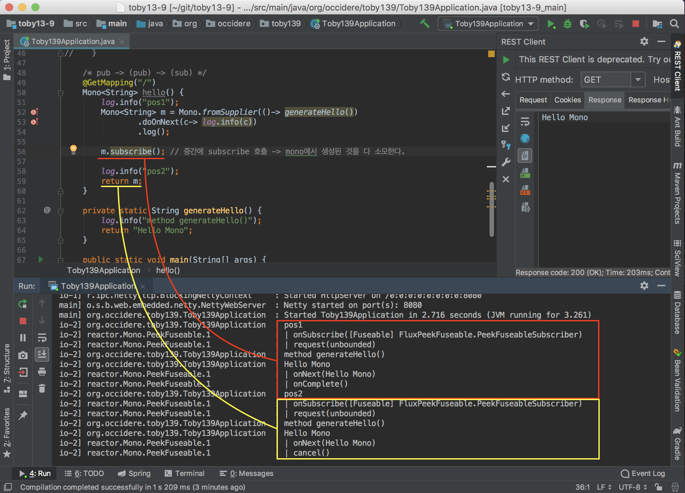

# Mono의 동작방식과 block()


##  지난주엔...

직접 구현했던 비동기 기술들을 동일한 기능을 하는 리액티브로 바꾸면 어떻게 할 수 있는가를 보여준 것

(Mono, Flux 등...)


## 이번주엔?

1. 스프링 리액티브 웹 프로젝트 환경 구축
   * 프로젝트 생성 (+ CE 에서 생성 https://start.spring.io/)
   * lombok Plugin 설치
   * Rest API Test Tools
2. Mono의 비동기 호출 처리 - log를 중심으로
   * 동기식 방법으로
   * 비동기식 방법으로
   * 여러번 Subscribe를 하면?
   * Cold type vs Hot type
   * block() 메서드...


ReactiveWeb = WebFlux


간단한 Rest API Test tool (Postman 과 비슷)

(사진)


mono에 log찍는거


## 1. 스프링 리액티브 웹 프로젝트 환경 구축

### 1-1. 프로젝트 생성

* New Project - Spring Initializr 선택
  
* Gradle Project 선택 (2.x.x)
  
* 라이브러리 선택 (Reactive Web: 필수, Lombok: 권장)
  
* 생성 완료
  

### * 만약 Community Edition 이라면?

1. https://start.spring.io/ 에 접속
2. 라이브러리 선택후 generate 하면 zip 파일로 다운로드 됨
   

### 1-2. Lombok 플러그인 설치


### 1-3. Rest API Test Tools

1. 간단한 컨트롤러 코드 작성

   ````java
   @SpringBootApplication
   @RestController
   @Slf4j
   public class Toby139Application {
   
       @GetMapping("/")
       Mono<String> hello() {
           return Mono.just("Helo WebFlux");
       }
   
       public static void main(String[] args) {
           SpringApplication.run(Toby139Application.class, args);
       }
   }
   ````

2. Rest API Tools 선택 (크롬의 postman과 비슷)
   

3. 실행
   


## 2. Mono의 비동기 호출 처리 - log를 중심으로

### 동기적 방법

1. 간단한 log 출력 코드 작성

   ````java
   /* pub -> (pub) -> (sub) */
   @GetMapping("/")
   Mono<String> hello() {
       return Mono.just("Helo WebFlux").log(); // log는 중간 pub
   }
   ````

   log가 출력 시점 확인
   

   * 실제로 call 이 들어와야 실행이 되며 로그가 찍히게 된다

2. 코드를 조금 더 확장

   ````java
   @GetMapping("/")
   Mono<String> hello() {
       log.info("pos1");
       Mono<String> m = Mono.just(generateHello())
           .doOnNext(c-> log.info(c))
           .log();
       log.info("pos2");
       return m;
   }
   
   private static String generateHello() {
       log.info("method generateHello()");
       return "Hello Mono";
   }
   ````

   log 출력 시점 확인

   


   * 즉, 실제 call (subscribe)이 들어오면 `Mono.just()`  에서 필요한 값을 **동기적으로 먼저 생성**한 다음 그 다음 단계들을 수행

   * 만약 본 예시에서 사용된 단순 String을 반환하는 작업이 아닌, **DB 연결이나 Api 콜 처럼 고 비용 작업인 경우 비 효율적**
   * 그렇다면 어떻게 비동기 처리?


### 비동기 방식

1. 코드 수정

   ````java
   @GetMapping("/")
   Mono<String> hello() {
       log.info("pos1");
       Mono<String> m = Mono.fromSupplier(()-> generateHello())
           .doOnNext(c-> log.info(c))
           .log();
       log.info("pos2");
       return m;
   }
   ````

   * just() 대신 **fromSupplier() 를 이용하여 인자로 함수를 전달**함

   log 출력 시점 확인
   

   * pos1, 2가 찍힌 후 generateHello() 처리가 됨 -> **비동기 처리**


### 여러번 Subscribe를 하면 어떻게 될까?

* 코드 작성

  ````java
  /* pub -> (pub) -> (sub) */
  @GetMapping("/")
  Mono<String> hello() {
      log.info("pos1");
      Mono<String> m = Mono.fromSupplier(()-> generateHello())
          .doOnNext(c-> log.info(c))
          .log();
  
      m.subscribe(); // 중간에 subscribe 호출 -> mono에서 생성된 것을 다 소모
  
      log.info("pos2");
      return m;
  }
  ````

  * 중간에 subscribe를 호출하여, 결과가 return되기 전에 모두 소모하는 코드
  * 어떻게 결과가 나올까?
    1. 서버 띄우는 과정에서 에러
    2. 서버는 띄워지는데, 호출 들어오면 에러
    3. 에러 없이 잘 됨
    4. 답 없음


  결과 확인

  

  * **Mono나 Flux등의 Publisher는 여러번 subscribe를 처리 가능!**
  * 이와 관련하여 Cold & Hot 타입으로 세분화 할 수 있다.


### Cold type vs Hot type

* **Cold type**

  * 데이터가 만들어져서 고정되어 있는 경우
    ex) DB 호출 등

  * 어떤 Subscriber 가 호출을 해도 언제나 동일한 결과값만 리턴

  * 호출 전 까지 100개의 데이터가 전달된 상황에서 호출을 하면, 매번 1 ~ 100 까지의 데이터를 처음부터 받아온 뒤, 그 다음 101번째 부터를 받아서 처리 = replay라고도 부름

* **Hot type**

  * 실시간으로 일어나는 외부 이벤트 처리
    ex) 유저가 UI에서 인터렉션 하는 것 등
  * 구독(호출)하는 시점부터 발생하는 데이터만 가져와서 리턴
  * 호출 전 까지 100개의 데이터가 날아온 상황에서 호출을 하면, cold 처럼 이전의 100개를 처음부터 다 가져오는 것이 아닌, 101번째 시점부터 발생한 데이터부터만 처리


### Block() 메서드...

* Mono에서 작업한 결과를 return 으로 넘어가기 전에 중간에 받는 것

코드 작성

````java
@GetMapping("/")
Mono<String> hello() {
    log.info("pos1");
    Mono<String> m = Mono.fromSupplier(()-> generateHello())
        .doOnNext(c-> log.info(c))
        .log();

    String msg = m.block(); // 결과값을 중간에 빼옴
    log.info("pos2: " + msg);

    return m;
}
````


수행 결과


-> IllegalStateException 발생..


원래라면 toby님의 예시처럼 되야했으나... 


**reactor v0.7.6 부터 Netty thread에서 block() 호출을 막았다**고 함 ([참고](https://github.com/reactor/reactor-netty/issues/351#issuecomment-387491702))
(스터디에서 사용한 버전: reactor-core-3.1.8.RELEASE.jar, reactor-netty-0.7.8.RELEASE.jar)


그래도 일단 설명을 계속하자면, block()을 사용시 위의 코드를 아래와 같이 개선 가능

````java
@GetMapping("/")
Mono<String> hello() {
    log.info("pos1");
    String msg = generateHello();

    Mono<String> m = Mono.just(msg)
        .doOnNext(c-> log.info(c))
        .log();

    String msg2 = m.block(); // 결과값을 중간에 빼옴
    log.info("pos2: " + msg2);

//  return m;
    return Mono.just(msg2); // 결과값(msg2)을 just()로 감싸서 리턴
}
````

* block으로 값을 빼왔으면, return에서 다시 Mono를 호출해서 처음부터 끝까지 재 생성 작업을 거치지 말고, **결과값을 Mono.just() 로 감싸서 전달하는 것이 훨씬 효율적**
* Mono 작업들이 DB 조회, Api 요청 등 고 비용 작업인 경우를 생각해보면 명확함
